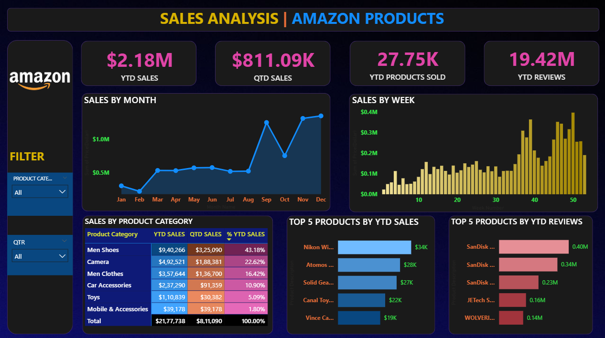

# 📊 Amazon Sales Analysis | Power BI Dashboard

A professional Power BI dashboard that provides key insights into Amazon product sales. This project visualizes essential metrics such as revenue trends, product performance, and customer engagement through dynamic visuals.

---

## 🧩 Problem Statement

Businesses selling on Amazon need to monitor product performance, sales trends, and customer behavior to make data-driven decisions. This dashboard helps stakeholders:

- Track revenue via **YTD** and **QTD** sales
- Monitor product popularity and seasonal demand
- Identify top-performing products by sales and reviews
- Gain insights from weekly and monthly sales fluctuations

---

## 🚀 Key KPIs Tracked

| KPI                     | Description                                                                |
|------------------------|-----------------------------------------------------------------------------|
| **YTD Sales**          | Total sales from the beginning of the year                                  |
| **QTD Sales**          | Sales in the current quarter                                                |
| **YTD Products Sold**  | Number of products sold year-to-date                                        |
| **YTD Reviews**        | Number of customer reviews received so far this year                        |

---

## 📈 Visualizations Included

- **Line Chart**: Sales by Month
- **Column Chart**: Sales by Week
- **Heatmap**: Sales by Product Category
- **Bar Charts**: Top Products by YTD Sales & YTD Reviews

---

## 🧾 Dataset

Included in the repository (`Amazon_Sales_Dataset.xlxs`)

---

## 🛠 Tools & Features Used

- Power BI Desktop
- Power Query for ETL
- DAX (YTD, QTD, Custom Calculations)
- Date Tables and Relationships
- Conditional Formatting
- Custom Sorting & Filtering
- Visual Navigation and KPI Cards

---

## 📷 Dashboard Preview



---

## 📁 Repository Contents

| File Name                     | Description                          |
|-------------------------------|--------------------------------------|
| `Amazon_Sales_Analysis.pbix`  | Power BI dashboard file              |
| `Amazon_Sales_Analysis.pbit`  | Power BI dashboard template          |
| `Amazon_Sales_Dataset.xlxs`   | Source dataset                       |  
| `README.md`                   | Documentation (this file)            |
| `Amazon_Dashboard.png`        | Final dashboard screenshot           |

---

## 🧑‍💻 Author

**Abhijay Chauhan**

---

## 📌 How to Use

1. Clone the repo:
   ```bash
   git clone https://github.com/yourusername/amazon-sales-analysis-powerbi.git
